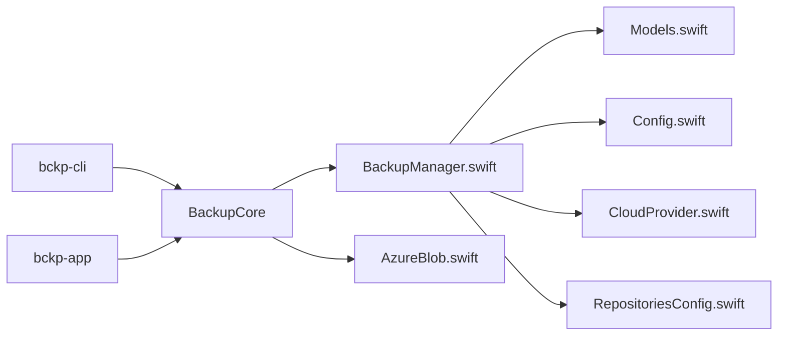

# bckp

A simple, native macOS backup tool (CLI + SwiftUI app) written in Swift. Creates snapshot folders you can browse and restore from.

- Language: Swift 5.9+
- Target: macOS 13+
- Arch: Apple Silicon (arm64) and Intel (universal by default when using `swift build`)

## Features
- Initialize a repository under `~/Backups/bckp` (configurable)
- Create snapshot(s) from one or more source directories
- Restore a snapshot to any destination
- List snapshots with counts and sizes (sizes shown in bytes)
- Include/Exclude glob patterns (relative to each source)
- Prune snapshots by keeping the last N and/or last D days
- Concurrency control and progress reporting during backup
- .bckpignore support per source folder (with !reinclude lines)
- Cloud repository (optional): Azure Blob Storage via SAS URL
- Repository usage tracking: persists last-used per repository and last-backup per source path
- GUI Repositories panel: browse repositories.json with filter, sort, live auto-refresh, and “Open JSON”
- CLI “repos” subcommand to inspect repositories.json (tab-separated rows or --json)

Repository layout:
```
<repo>/
  config.json
  snapshots/
    <SNAPSHOT_ID>/
      manifest.json
      data/
        <source-basename>/...
```

## Quick start

### Prerequisites
- macOS 13+ (works on macOS 15 Apple Silicon)
- Xcode (full) recommended so `swift test` has XCTest SDKs
  - Set active developer dir if needed: `sudo xcode-select -s /Applications/Xcode.app/Contents/Developer`

### Build and test
```bash
swift build              # compile
swift run bckp --help    # show commands
swift test               # run tests (requires full Xcode SDKs)
```

### Run the GUI (SwiftUI app)
> [!WARNING]  
> GUI is in heavy development and should NOT be considered as usable yet!

```bash
swift run bckp-app
```
The app lets you:
- Choose and initialize a local repository
- Add sources, run backups with progress, and view logs
- Edit configuration (include/exclude, concurrency, Azure SAS)
- Run Cloud actions (Init, List, Cloud Backup, Cloud Restore)
- Open the Repositories panel (toolbar) to inspect repositories.json with:
  - Search filter across repo keys and source paths
  - Sort by Key, Last used, or Last backup (desc for dates)
  - Live auto‑refresh when the file changes
  - “Open JSON” to reveal the file in Finder and “Copy key” per repo

### Configuration
The CLI and GUI read defaults from a simple config file. Flags always override config.

Locations (first found wins):
- `./bckp.config` next to the default repo (created by the app when saving), or
- `~/.config/bckp/config`

Format (INI-like):
```
[repo]
path = /Users/you/Backups/bckp

[backup]
include = **/*
exclude = **/.git/**, **/node_modules/**
concurrency = 8

[azure]
sas = https://acct.blob.core.windows.net/container?sv=...&sig=...
```
A `config.sample` is provided in the repo. The real config is ignored by git.

### Initialize a repo
```bash
swift run bckp init-repo --repo ~/Backups/bckp
```

### Create a backup
```bash
swift run bckp backup --source ~/Documents --source ~/Pictures --repo ~/Backups/bckp \
  --include "**/*.jpg" --include "**/*.png" \
  --exclude "**/.git/**" --exclude "**/*.tmp"
```

Enable progress and tune concurrency (optional):
```bash
swift run bckp backup --source ~/Documents --repo ~/Backups/bckp --progress --concurrency 8
```

Per-source ignores
Create a `.bckpignore` file in any source folder to override CLI include/exclude for that source. Example:
```
# exclude node_modules everywhere under this source
**/node_modules/**

# exclude logs
**/*.log

# re-include a specific file
!keep/important.log

# optional directive style also works
include: src/**
exclude: **/.DS_Store
```

### List snapshots
```bash
swift run bckp list --repo ~/Backups/bckp
```

### Inspect tracked repositories (repositories.json)
```bash
# Tab-separated: KEY<TAB>LastUsedISO8601<TAB>SourcePath<TAB>LastBackupISO8601
swift run bckp repos

# Or pretty JSON
swift run bckp repos --json
```

### Restore a snapshot
```bash
swift run bckp restore <SNAPSHOT_ID> --repo ~/Backups/bckp --destination ~/RestoreHere
```

### Prune old snapshots
```bash
# keep last 5 snapshots
swift run bckp prune --repo ~/Backups/bckp --keep-last 5

# or keep snapshots from the last 30 days
swift run bckp prune --repo ~/Backups/bckp --keep-days 30
```

## Release (build a distributable binary)

### Debug (fast, default)
```bash
swift build
ls -l .build/debug/bckp
```

### Release (optimized)
```bash
swift build -c release
ls -l .build/release/bckp
```

You can copy the built binary to a directory in your PATH (e.g., `~/bin`) or wrap it in a small `.pkg`/`.dmg` later.

### Azure (SAS) Cloud Repo
You can pass `--sas` explicitly, or omit it to use the value from your config.

- Initialize the container as a repo (writes config.json at container root)
```bash
swift run bckp init-azure --sas "https://<acct>.blob.core.windows.net/<container>?sv=...&sig=..."
# or use config: set [azure] sas in your config and run
swift run bckp init-azure
```

- Backup to Azure
```bash
swift run bckp backup-azure --source ~/Documents --source ~/Pictures \
  --include "**/*" --exclude "**/.git/**" --concurrency 8 --progress
# optionally add --sas to override config
```

- List Azure snapshots
```bash
swift run bckp list-azure   # uses config SAS, or add --sas
```

- Restore from Azure
```bash
swift run bckp restore-azure <SNAPSHOT_ID> --destination /tmp/restore --concurrency 8
# optionally add --sas to override config
```

- Prune Azure snapshots
```bash
swift run bckp prune-azure --keep-last 10  # or --keep-days D
# optionally add --sas to override config
```

Azure SAS: use a container-level SAS. For backup: write + list (and create). For restore/list: read (and list). Keep SAS secrets safe.

## Repository usage tracking (repositories.json)
The tool tracks "which repos you use" and "when each source path was last backed up" to help future UI/automation.

- Location (macOS): `~/Library/Application Support/bckp/repositories.json`
- Tracked per repository key:
  - lastUsedAt: ISO8601 date when the repo was last touched by any command
  - sources[]: array of { path, lastBackupAt } for configured/seen source paths
- Keys are normalized:
  - Local repos: standardized absolute path
  - Azure repos: container URL without SAS query/fragment (scheme/host lowercased by URLComponents)
- Updated automatically by CLI operations:
  - local: init-repo, backup, restore, list, prune
  - azure: init-azure, backup-azure, restore-azure, list-azure, prune-azure

Inspect/visualize:
- CLI: `swift run bckp repos` (or `--json`) prints tracked entries
- GUI: Repositories panel lists repos with filter/sort, auto-refresh, and quick actions (Open JSON, Copy key)

Example shape:
```json
{
  "repositories": {
    "/Users/you/Backups/bckp": {
      "lastUsedAt": "2025-08-17T12:34:56Z",
      "sources": [
        { "path": "/Users/you/Documents", "lastBackupAt": "2025-08-17T12:34:56Z" },
        { "path": "/Users/you/Pictures", "lastBackupAt": null }
      ]
    }
  }
}
```

## Architecture

This section documents how bckp is structured across modules, the core data model, and the main execution flows. It is a living guide for contributors and can be used to generate a dependency diagram.

### High‑level overview

- BackupCore (library): cross‑platform Swift library with the backup engine, models, configuration parsing, Azure client, and repositories.json store.
- bckp-cli (executable): the command‑line interface; thin orchestration over BackupCore.
- bckp-app (executable): SwiftUI GUI; presents common operations and visualizes repositories.json.

Dependency diagram:


Key design choices:
- Files are copied (no dedup/hard‑links yet); manifests describe snapshots.
- Filtering uses glob patterns plus per‑source .bckpignore with re‑include support.
- Concurrency: OperationQueue with a tunable limit; progress aggregated on a serial queue.
- Persistence: JSON (Codable) with ISO8601 dates; atomic writes for consistency.

### Modules and responsibilities

- BackupManager.swift
  - Local repo lifecycle: init, ensure initialized.
  - Operations: backup (plan + execute), list, restore, prune.
  - Azure operations (via extension): init, backup, list, restore, prune (delegates I/O to AzureBlobClient).
  - Utilities: snapshot ID generation, relative path normalization, include/exclude helpers.

- Models.swift
  - Snapshot, SnapshotListItem, RepoConfig, BackupOptions, BackupProgress, PrunePolicy, PruneResult.

- Config.swift
  - AppConfig parser/writer (INI‑like), default locations, merging of settings.

- CloudProvider.swift
  - Abstraction for cloud backends; current implementation: AzureBlobProvider.

- AzureBlob.swift
  - Minimal synchronous client using URLSession for blob PUT/GET/LIST/DELETE/HEAD.
  - Chunked uploads for large files (Put Block + Put Block List).
  - Simple XML parsing for list results; API version pinned for stability.

- RepositoriesConfig.swift
  - RepositoriesConfigStore: thread‑safe, serialized I/O store for repositories.json.
  - Tracks lastUsedAt per repo and lastBackupAt per source.
  - Key normalization: local absolute path; Azure container URL without query/fragment.

- bckp-cli/main.swift
  - Orchestrates user commands; converts flags to BackupOptions/AppConfig; prints results.
  - Updates RepositoriesConfigStore on init/backup/list/restore/prune (local and Azure).

- bckp-app (SwiftUI)
  - ContentView: main controls and usage summaries.
  - RepositoriesPanel: lists repositories.json with filter/sort, live auto‑refresh, quick actions.

### Data layout and formats

Local repo on disk:
```
<repo>/
  config.json                 # RepoConfig
  snapshots/
    <SNAPSHOT_ID>/
      manifest.json           # Snapshot
      data/
        <source-basename>/... # preserved directory trees
```

Azure container layout mirrors local:
```
snapshots/<SNAPSHOT_ID>/manifest.json
snapshots/<SNAPSHOT_ID>/data/<source-basename>/...
snapshots/<SNAPSHOT_ID>/symlinks.json            # optional
config.json                                       # at container root
```

repositories.json (Application Support):
- JSON object with repositories map: key -> { lastUsedAt, sources[] }.
- Dates encoded as ISO8601; file writes are atomic.

### Execution flows (abridged)

Local backup:
1) ensureRepoInitialized → compute snapshotId → create directories.
2) Plan phase: enumerate sources, apply filters (.bckpignore overrides CLI), build WorkItems and totals.
3) Execute phase: copy files concurrently with per‑op FileManager; emit BackupProgress.
4) Write manifest.json; return Snapshot; update repositories.json via CLI/GUI layer.

Azure backup:
1) ensureAzureRepoInitialized → compute snapshotId.
2) Plan like local; tasks mapped to blob paths under snapshots/<id>/data.
3) Upload: single PUT for small, chunked for large; progress emitted similarly.
4) Upload manifest.json (and symlinks.json if present); return Snapshot.

List snapshots:
- Local: read manifests from each snapshot dir; sort by createdAt.
- Azure: list prefixes under snapshots/; download manifest.json per prefix; sort.

Restore:
- Local: copy files from data/ back to destination; recreate symlinks.
- Azure: list blobs under data prefix; download concurrently; recreate symlinks if present.

Prune:
- Compute kept IDs by union of keepLast and keepDays; delete others (local: remove dirs; Azure: list+delete blobs by prefix).

### Error handling and edge cases

- Invalid source paths → BackupError.notADirectory.
- Missing repo config → BackupError.repoNotInitialized.
- Azure HTTP errors mapped to AzureError.* with status codes.
- Glob filtering ensures directories can still be traversed; reincludes override excludes.
- Standardized paths mitigate symlinked parent differences (/var vs /private/var).

### Concurrency and performance

- OperationQueue for copy/upload/download with maxConcurrentOperationCount from options or CPU count.
- Per‑operation FileManager for thread safety.
- Atomic writes for JSON artifacts to avoid partial files.

### Extension points

- Add a new cloud provider:
  - Implement CloudProvider for your backend.
  - Provide a client similar to AzureBlobClient for basic CRUD and listing.
  - Add CLI subcommands mirroring Azure variants and wire RepositoriesConfigStore updates.

- Possible future enhancements:
  - Deduplication/hard‑linking; delta uploads; encryption; restore previews.
  - More providers (S3, GCS); richer GUI dashboards.

### Testing

- Unit tests cover filtering, local engine flows, repositories.json store (local/Azure keys), and an optional Azure integration test driven by config SAS.
- Tests set RepositoriesConfigStore.overrideFileURL to avoid touching the real Application Support path.

## Notes
- Current version copies files; deduplication/hard-linking can be added later.
- Symlinks are preserved when possible.
- Hidden files are skipped during backup; adjust in code if needed.
- Some folders require Full Disk Access. Grant your Terminal app Full Disk Access in System Settings > Privacy & Security.
- Tests may fail with `no such module XCTest` if only Command Line Tools are installed. Install full Xcode and run `sudo xcode-select -s /Applications/Xcode.app/Contents/Developer`.

### Tests (Azure integration)
- `swift test` runs local tests and an optional Azure integration test.
- If `~/.config/bckp/config` contains a valid `[azure] sas`, the Azure test performs init, upload, list, and restore against your container.
- If SAS is missing/empty, the Azure test is skipped with a clear message.
