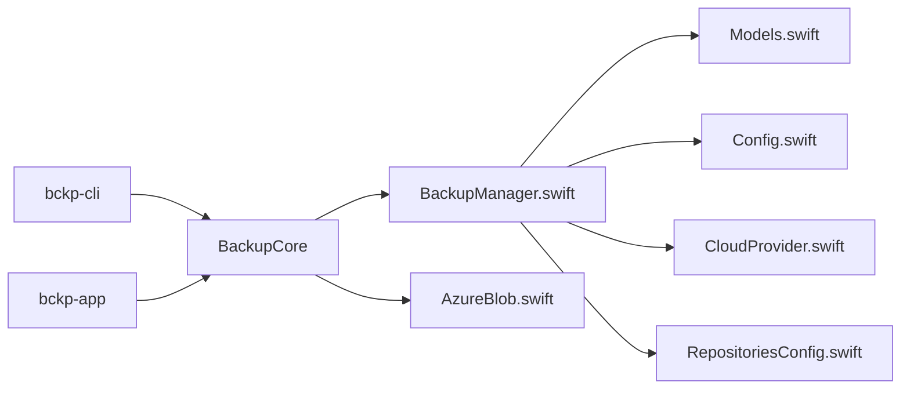

# bckp

A simple, native macOS backup tool (CLI + SwiftUI app) written in Swift. Creates snapshot folders you can browse and restore from.

- Language: Swift 5.9+
- Target: macOS 13+
- Arch: Apple Silicon (arm64) and Intel (universal by default when using `swift build`)

## Features
- Initialize a repository under `~/Backups/bckp` (configurable)
- Create snapshot(s) from one or more source directories
- Restore a snapshot to any destination
- List snapshots with counts and sizes (sizes shown in bytes)
- Include/Exclude glob patterns (relative to each source)
- Prune snapshots by keeping the last N and/or last D days
- Concurrency control and progress reporting during backup
- .bckpignore support per source folder (with !reinclude lines)
- Cloud repository (optional): Azure Blob Storage via SAS URL
- Repository usage tracking: persists last-used per repository and last-backup per source path
- GUI Repositories panel: browse repositories.json with filter, sort, live auto-refresh, and “Open JSON”
- CLI “repos” subcommand to inspect repositories.json (tab-separated rows or --json)
 - CLI “repos” subcommand to inspect repositories.json (tab-separated rows or --json), plus `--clear` to reset the index
- External drives aware: on macOS, local repo keys include the external volume UUID when available, for stability across re-mounts
- GUI external-drive picker (macOS): select an external volume, set a subpath, show the volume UUID and derived repositories.json key, and copy the key

Repository layout (snapshots now use APFS sparse disk images):
```
<repo>/
  config.json
  snapshots/
    <SNAPSHOT_ID>.sparseimage       # APFS sparse image; contains manifest.json and data/
    [legacy] <SNAPSHOT_ID>/...      # Older directory-based snapshots are still supported
```

## Quick start

### Prerequisites
- macOS 13+ (works on macOS 15 Apple Silicon)
- Xcode (full) recommended so `swift test` has XCTest SDKs
  - Set active developer dir if needed: `sudo xcode-select -s /Applications/Xcode.app/Contents/Developer`

### Build and test
```bash
swift build              # compile
swift run bckp --help    # show commands
swift test               # run tests (requires full Xcode SDKs)
```

### Run the GUI (SwiftUI app)
> [!WARNING]  
> GUI is in heavy development and should NOT be considered as usable yet!

```bash
swift run bckp-app
```
The app lets you:
- Choose and initialize a local repository
- Use an external-drive picker (macOS) to choose a mounted external/removable volume, enter a subpath (e.g., Backups/bckp), and set the repo path accordingly. When the repo resides on an external volume, the app shows the volume UUID and the derived repositories.json key and offers a “Copy Repo Key” action.
- Add sources, run backups with progress, and view logs
- Edit configuration (include/exclude, concurrency, Azure SAS)
- Run Cloud actions (Init, List, Cloud Backup, Cloud Restore)
- Open the Repositories panel (toolbar) to inspect repositories.json with:
  - Search filter across repo keys and source paths
  - Sort by Key, Last used, or Last backup (desc for dates)
  - Live auto‑refresh when the file changes
  - “Open JSON” to reveal the file in Finder and “Copy key” per repo

## Install from Releases

Prebuilt artifacts are published on each tag in GitHub Releases. You’ll see three macOS downloads:

- bckp-<version>-macos.zip
  - CLI executable. Unzip and run from Terminal.
  - Example:
    - unzip → file named `bckp`
    - run: `./bckp --help`
  - If macOS Gatekeeper blocks it (unsigned/not notarized yet), you can allow it:
    - Remove quarantine attributes:
      - `xattr -dr com.apple.quarantine bckp`

- bckp-app-<version>-macos.zip
  - GUI executable as a raw binary (not a Finder app). Launch from Terminal:
    - unzip → file named `bckp-app`
    - run: `./bckp-app`
  - This is useful for debugging; it’s not a proper `.app` bundle.
  - If macOS Gatekeeper blocks it (unsigned/not notarized yet), you can allow it:
    - Remove quarantine attributes:
      - `xattr -dr com.apple.quarantine bckp-app`

- bckp-app-<version>-macos.app.zip
  - Double‑clickable macOS app bundle for Finder.
  - Unzip, then move `bckp-app.app` to `/Applications` (or `~/Applications`).
  - If macOS Gatekeeper blocks it (unsigned/not notarized yet), you can allow it:
    - Remove quarantine attributes:
      - `xattr -dr com.apple.quarantine ~/Applications/bckp-app.app`

Checksums: a `SHA256SUMS` file is attached to the release.

### Configuration
The CLI and GUI read defaults from a simple config file. Flags always override config.

Locations (first found wins):
- `./bckp.config` next to the default repo (created by the app when saving), or
- `~/.config/bckp/config`

Format (INI-like):
```
[repo]
path = /Users/you/Backups/bckp

[backup]
include = **/*
exclude = **/.git/**, **/node_modules/**
concurrency = 8

[azure]
sas = https://acct.blob.core.windows.net/container?sv=...&sig=...
```
A `config.sample` is provided in the repo. The real config is ignored by git.

### Initialize a repo
```bash
swift run bckp init-repo --repo ~/Backups/bckp
```

### Create a backup
```bash
swift run bckp backup --source ~/Documents --source ~/Pictures --repo ~/Backups/bckp \
  --include "**/*.jpg" --include "**/*.png" \
  --exclude "**/.git/**" --exclude "**/*.tmp"
```

Enable progress and tune concurrency (optional):
```bash
swift run bckp backup --source ~/Documents --repo ~/Backups/bckp --progress --concurrency 8
```

Per-source ignores
Create a `.bckpignore` file in any source folder to override CLI include/exclude for that source. Example:
```
# exclude node_modules everywhere under this source
**/node_modules/**

# exclude logs
**/*.log

# re-include a specific file
!keep/important.log

# optional directive style also works
include: src/**
exclude: **/.DS_Store
```

### List snapshots
```bash
swift run bckp list --repo ~/Backups/bckp
```

### Inspect tracked repositories (repositories.json)
```bash
# Tab-separated: KEY<TAB>LastUsedISO8601<TAB>SourcePath<TAB>LastBackupISO8601
swift run bckp repos

# Or pretty JSON
swift run bckp repos --json

# Reset the index (dangerous; does not delete snapshots)
swift run bckp repos --clear
```

### Restore a snapshot
```bash
swift run bckp restore <SNAPSHOT_ID> --repo ~/Backups/bckp --destination ~/RestoreHere
```

### Prune old snapshots
```bash
# keep last 5 snapshots
swift run bckp prune --repo ~/Backups/bckp --keep-last 5

# or keep snapshots from the last 30 days
swift run bckp prune --repo ~/Backups/bckp --keep-days 30

# Force delete ALL snapshots, including the newest (dangerous)
swift run bckp prune --repo ~/Backups/bckp --force-all
```

Notes:
- By default, pruning is safety‑first and always keeps the newest snapshot even if `--keep-last 0 --keep-days 0` are given. Use `--force-all` to bypass this safety and remove everything.

### External drives (macOS)

- List external/removable drives and their UUIDs:
```bash
swift run bckp drives
```

- Pretty JSON output:
```bash
swift run bckp drives --json
```

- Initialize a repo on a specific external volume by UUID (default subpath: Backups/bckp):
```bash
swift run bckp init-repo --external-uuid <VOLUME-UUID>
```

- Customize the subpath under the volume mount point:
```bash
swift run bckp init-repo --external-uuid <VOLUME-UUID> --external-subpath "Backups/bckp-personal"
```

Notes:
- On macOS, repositories.json uses a stable key for external volumes: `ext://volumeUUID=<UUID><standardizedPath>`. This keeps entries stable across volume renames or mount-point changes.
- The GUI surfaces the external volume UUID and the derived repo key and lets you copy the key for troubleshooting.

## Build from source

### Debug (fast, default)
```bash
swift build
ls -l .build/debug/bckp
```

### Release (optimized)
```bash
swift build -c release
ls -l .build/release/bckp
```

You can copy the built binary to a directory in your PATH (e.g., `~/bin`). Packaging and signing/notarization are tracked as future improvements.

### Azure (SAS) Cloud Repo
You can pass `--sas` explicitly, or omit it to use the value from your config.

- Initialize the container as a repo (writes config.json at container root)
```bash
swift run bckp init-azure --sas "https://<acct>.blob.core.windows.net/<container>?sv=...&sig=..."
# or use config: set [azure] sas in your config and run
swift run bckp init-azure
```

- Backup to Azure
```bash
swift run bckp backup-azure --source ~/Documents --source ~/Pictures \
  --include "**/*" --exclude "**/.git/**" --concurrency 8 --progress
# optionally add --sas to override config
```

When running with `--progress`, the CLI prints high‑level stage tags only (no file names):

```
[plan] ...
[disk] created ... / attached ...
[data] copying data...
[data] staging complete
[disk] detaching / detached
[hash] computing MD5
MD5 <base64>
[azure] upload start ...
[azure] PUT ...
[azure] verified MD5
[cleanup] removed local image
```

The final summary includes the MD5 when `--progress` is used.

- List Azure snapshots
```bash
swift run bckp list-azure   # uses config SAS, or add --sas
```

- Restore from Azure
```bash
swift run bckp restore-azure <SNAPSHOT_ID> --destination /tmp/restore --concurrency 8
# optionally add --sas to override config
```

- Prune Azure snapshots
```bash
swift run bckp prune-azure --keep-last 10  # or --keep-days D
# optionally add --sas to override config

# Force delete ALL cloud snapshots, including the newest (dangerous)
swift run bckp prune-azure --force-all
```

Azure SAS: use a container-level SAS. For backup: write + list (and create). For restore/list: read (and list). Keep SAS secrets safe.

## Sparse‑image snapshots (what gets created and where) 🔍

This project stages each backup into an APFS sparse disk image for reliable atomic snapshots and faster cloud transfers.

- Local repository snapshot artifact
  - File path: `<repo>/snapshots/<SNAPSHOT_ID>.sparseimage`
  - Inside the mounted image: `/manifest.json`, `/data/<source-basename>/...` and, if present, `/symlinks.json`
  - During backup/list/restore, the image is temporarily attached under `~/Backups` at a predictable per‑run mount point, for example: `~/Backups/bckp-local-<SNAPSHOT_ID>`.
  - After the operation, the image is detached; the `.sparseimage` file remains in `snapshots/`.

- Azure container snapshot artifacts
  - Image blob: `snapshots/<SNAPSHOT_ID>/<SNAPSHOT_ID>.sparseimage`
  - Manifest blob: `snapshots/<SNAPSHOT_ID>/manifest.json`
  - Optional symlinks map: `snapshots/<SNAPSHOT_ID>/symlinks.json`
  - When restoring or listing, the image is downloaded to `~/Backups/bckp-restore-<SNAPSHOT_ID>.sparseimage` and attached at `~/Backups/bckp-restore-mount-<SNAPSHOT_ID>`, then detached and the local image is removed on completion.

Operational safety and integrity
- Before detaching a mounted image, the tool checks if the mount point appears busy (open files under it) and will refuse to detach in that case.
- Azure uploads compute an MD5 checksum of the sparse image and verify it against the blob’s MD5 after upload; the local staging image is deleted only after successful verification.

- Legacy directory snapshots
  - Older snapshots may exist as a directory tree at `<repo>/snapshots/<SNAPSHOT_ID>/` with `manifest.json` and `data/` inside. Listing and restore support both formats.

Notes on sizing
- The sparse image capacity is computed from the planned copy size with headroom: at least 50% extra (minimum 64 MiB), rounded up to 8‑MiB blocks to avoid ENOSPC due to filesystem overhead. This is transparent to users but explains why images may appear larger than the raw data sum.

Azure upload block size
- For small images (≤ 8 MiB) the upload uses a single Put Blob request.
- For larger images the upload streams using Azure Block Blob with 8‑MiB blocks (Put Block/Put Block List). The last block may be smaller. An MD5 over the full image is set and then verified after upload before local cleanup.

## Repository usage tracking (repositories.json)
The tool tracks "which repos you use" and "when each source path was last backed up" to help future UI/automation.

- Location (macOS): `~/Library/Application Support/bckp/repositories.json`
- Tracked per repository key:
  - lastUsedAt: ISO8601 date when the repo was last touched by any command
  - sources[]: array of { path, lastBackupAt } for configured/seen source paths
- Keys are normalized:
  - Local repos (macOS): if the repo is on an external/removable volume and a stable volume UUID is available, the key becomes `ext://volumeUUID=<UUID><standardizedPath>`; otherwise it’s the standardized absolute path.
  - Azure repos: container URL without SAS query/fragment (scheme/host lowercased by URLComponents)
- Updated automatically by CLI operations:
  - local: init-repo, backup, restore, list, prune
  - azure: init-azure, backup-azure, restore-azure, list-azure, prune-azure

Inspect/visualize:
- CLI: `swift run bckp repos` (or `--json`) prints tracked entries
- GUI: Repositories panel lists repos with filter/sort, auto-refresh, and quick actions (Open JSON, Copy key)

Example shape:
```json
{
  "repositories": {
  "ext://volumeUUID=123E4567-E89B-12D3-A456-426614174000/Volumes/MyDrive/Backups/bckp": {
      "lastUsedAt": "2025-08-17T12:34:56Z",
      "sources": [
        { "path": "/Users/you/Documents", "lastBackupAt": "2025-08-17T12:34:56Z" },
        { "path": "/Users/you/Pictures", "lastBackupAt": null }
      ]
    }
  }
}
```

Compatibility notes:
- If the volume UUID is not exposed by the system, keys remain path-only as before.
- Moving a local repo between disks can change its key; the GUI shows keys and lets you copy them. This only affects the repositories.json index, not your snapshots.

## Optional CLI integration tests

There’s an opt-in macOS-only CLI integration test that verifies the `drives --json` output contains the selected external volume UUID.

Requirements:
- At least one external/removable volume with a readable volume UUID must be mounted, otherwise the test is skipped.
- Full Xcode SDKs installed (for XCTest), same as other tests.

How to run:
```zsh
# Build first so the CLI binary exists
swift build

# Run the full test suite including the CLI test
BCKP_RUN_CLI_TESTS=1 swift test

# Or run just the CLI test suite
BCKP_RUN_CLI_TESTS=1 swift test --filter CLIDrivesIntegrationTests
```

Implementation details:
- The test executes the already-built `bckp` binary under `.build/.../bckp` directly (not `swift run`) to avoid SwiftPM re-entrancy hangs during `swift test`.
- A 20-second timeout aborts the process if it stalls and prints captured stdout/stderr for diagnosis.

## Architecture

This section documents how bckp is structured across modules, the core data model, and the main execution flows. It is a living guide for contributors and includes a dependency diagram.

### High‑level overview

- BackupCore (library): cross‑platform Swift library with the backup engine, models, configuration parsing, Azure client, and repositories.json store.
- bckp-cli (executable): the command‑line interface; thin orchestration over BackupCore.
- bckp-app (executable): SwiftUI GUI; presents common operations and visualizes repositories.json.

Dependency diagram:


Key design choices:
- Files are copied (no dedup/hard‑links yet); manifests describe snapshots.
- Filtering uses glob patterns plus per‑source .bckpignore with re‑include support.
- Concurrency: OperationQueue with a tunable limit; progress aggregated on a serial queue.
- Persistence: JSON (Codable) with ISO8601 dates; atomic writes for consistency.

### Modules and responsibilities

- BackupManager.swift
  - Local repo lifecycle: init, ensure initialized.
  - Operations: backup (plan + execute), list, restore, prune.
  - Azure operations (via extension): init, backup, list, restore, prune (delegates I/O to AzureBlobClient).
  - Utilities: snapshot ID generation, relative path normalization, include/exclude helpers.

- Models.swift
  - Snapshot, SnapshotListItem, RepoConfig, BackupOptions, BackupProgress, PrunePolicy, PruneResult.

- Config.swift
  - AppConfig parser/writer (INI‑like), default locations, merging of settings.

- CloudProvider.swift
  - Abstraction for cloud backends; current implementation: AzureBlobProvider.

- AzureBlob.swift
  - Minimal synchronous client using URLSession for blob PUT/GET/LIST/DELETE/HEAD.
  - Chunked uploads for large files (Put Block + Put Block List).
  - Simple XML parsing for list results; API version pinned for stability.

- RepositoriesConfig.swift
  - RepositoriesConfigStore: thread‑safe, serialized I/O store for repositories.json.
  - Tracks lastUsedAt per repo and lastBackupAt per source.
  - Key normalization: local absolute path; Azure container URL without query/fragment.

- bckp-cli/main.swift
  - Orchestrates user commands; converts flags to BackupOptions/AppConfig; prints results.
  - Updates RepositoriesConfigStore on init/backup/list/restore/prune (local and Azure).

- bckp-app (SwiftUI)
  - ContentView: main controls and usage summaries.
  - RepositoriesPanel: lists repositories.json with filter/sort, live auto‑refresh, quick actions.

### Data layout and formats

Local repo on disk:
```
<repo>/
  config.json                   # RepoConfig
  snapshots/
    <SNAPSHOT_ID>.sparseimage   # APFS sparse image containing manifest.json, data/, symlinks.json (optional)
    [legacy] <SNAPSHOT_ID>/...  # Older directory-based layout still supported for restore/list
```

Azure container layout mirrors local (image + sidecar manifest):
```
config.json                                       # at container root
snapshots/<SNAPSHOT_ID>/<SNAPSHOT_ID>.sparseimage # APFS sparse image artifact
snapshots/<SNAPSHOT_ID>/manifest.json             # sidecar manifest for quick listing
snapshots/<SNAPSHOT_ID>/symlinks.json             # optional (legacy/compat helpers)
```

repositories.json (Application Support):
- JSON object with repositories map: key -> { lastUsedAt, sources[] }.
- Dates encoded as ISO8601; file writes are atomic.

### Execution flows (abridged)

Local backup:
1) ensureRepoInitialized → compute snapshotId → create a right‑sized APFS sparse image at `<repo>/snapshots/<SNAPSHOT_ID>.sparseimage` and attach it to a temporary mount point.
2) Plan phase: enumerate sources, apply filters (.bckpignore overrides CLI), build WorkItems and totals; image sized as totalBytes + headroom.
3) Execute phase: copy directly into the mounted image under `/data/<source-basename>/...`; emit BackupProgress.
4) Write `/manifest.json` inside the mounted image; detach; return Snapshot; update repositories.json via CLI/GUI layer.

Azure backup:
1) ensureAzureRepoInitialized → compute snapshotId.
2) Plan like local; stage files into a temporary right‑sized APFS sparse image (same as local).
3) Detach the image and upload two blobs under `snapshots/<SNAPSHOT_ID>/`: `<SNAPSHOT_ID>.sparseimage` and `manifest.json` (plus `symlinks.json` if present). Large image uploads use chunked blocks.
4) Return Snapshot; repositories.json is updated by the CLI/GUI layer.

List snapshots:
- Local: for `.sparseimage` snapshots, temporarily attach and read `/manifest.json`; for legacy directory snapshots, read manifest from the directory; sort by createdAt.
- Azure: list prefixes under `snapshots/`; download `manifest.json` per prefix (no need to download the image); sort.

Restore:
- Local: if the snapshot is a `.sparseimage`, attach it, copy from `/data/` to the destination, recreate symlinks, then detach. Legacy directory snapshots copy from the on‑disk `data/`.
- Azure: download `<SNAPSHOT_ID>.sparseimage`, attach it, copy from `/data/` to the destination, recreate symlinks, then detach. If a legacy directory snapshot exists in the container, fall back to per‑file download.

Prune:
- Compute kept IDs by union of keepLast and keepDays; delete others (local: remove dirs; Azure: list+delete blobs by prefix).

### Error handling and edge cases

- Invalid source paths → BackupError.notADirectory.
- Missing repo config → BackupError.repoNotInitialized.
- Azure HTTP errors mapped to AzureError.* with status codes.
- Glob filtering ensures directories can still be traversed; reincludes override excludes.
- Standardized paths mitigate symlinked parent differences (/var vs /private/var).

### Concurrency and performance

- OperationQueue for copy/upload/download with maxConcurrentOperationCount from options or CPU count.
- Per‑operation FileManager for thread safety.
- Atomic writes for JSON artifacts to avoid partial files.

### Extension points

- Add a new cloud provider:
  - Implement CloudProvider for your backend.
  - Provide a client similar to AzureBlobClient for basic CRUD and listing.
  - Add CLI subcommands mirroring Azure variants and wire RepositoriesConfigStore updates.

- Possible future enhancements:
  - Deduplication/hard‑linking; delta uploads; encryption; restore previews.
  - More providers (S3, GCS); richer GUI dashboards.

### Testing

- Unit tests cover filtering, local engine flows, repositories.json store (local/Azure keys), and an optional Azure integration test driven by a config Shared Access Signature (SAS) token for Azure.
- Tests set RepositoriesConfigStore.overrideFileURL to avoid touching the real Application Support path.

## Notes
- Current version copies files; deduplication/hard-linking can be added later.
- Symlinks are preserved when possible.
- Hidden files are skipped during backup; adjust in code if needed.
- Logging: human-readable NDJSON lines written under `~/Library/Logs/bckp/` by default; adjustable via config `[logging] debug=true`.
- Some folders require Full Disk Access. Grant your Terminal app Full Disk Access in System Settings > Privacy & Security.
- Tests may fail with `no such module XCTest` if only Command Line Tools are installed. Install full Xcode and run `sudo xcode-select -s /Applications/Xcode.app/Contents/Developer`.
 - Encryption status: Sparse‑image snapshots are not encrypted by bckp yet. Use FileVault/disk encryption if needed today. A native macOS encryption feature is being explored; the ObjectivePGP PoC is not active in the current sparse‑image flow.

### Tests (Azure integration)
- `swift test` runs local tests and an optional Azure integration test.
- If `~/.config/bckp/config` contains a valid `[azure] sas`, the Azure test performs init, upload, list, and restore against your container.
- If SAS is missing/empty, the Azure test is skipped with a clear message.
